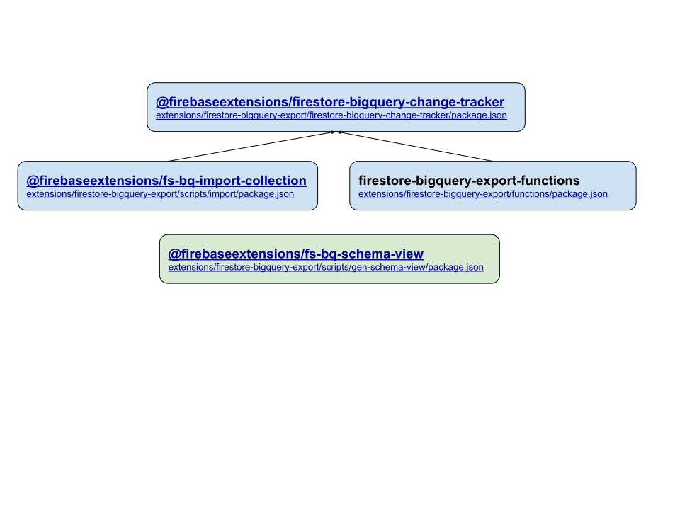

# Development Setup

The firestore-bigquery-export extension is split out into 4 node.js packages, three of
which are hosted on [npm](https://www.npmjs.com/search?q=firebaseextensions).

**firestore-bigquery-change-tracker**: Contains the core interface defintions
for document changes. Also exposes an API for uploading changes to BigQuery.
The business-logic associated with creating the raw changelog and the latest
snapshot of live documents in the changelog also lives in this package.

**fs-bq-import-collection**: Contains a script for resumably importing a
firestore collection into BigQuery using the interface definitions in
`firestore-bigquery-change-tracker`.

**fs-bq-schema-views**: Contains a script for generating BigQuery views that
provide typed-checked access to the changelog created in
`firestore-bigquery-change-tracker`.

**firestore-bigquery-export-functions (not hosted)**: Contains the definition
for a Google Cloud function that is called on each write to some collection.
The function constructs the relevant change event and calls the API in
`firestore-bigquery-change-tracker` to upload the change to BigQuery.

## Dependency Diagram

